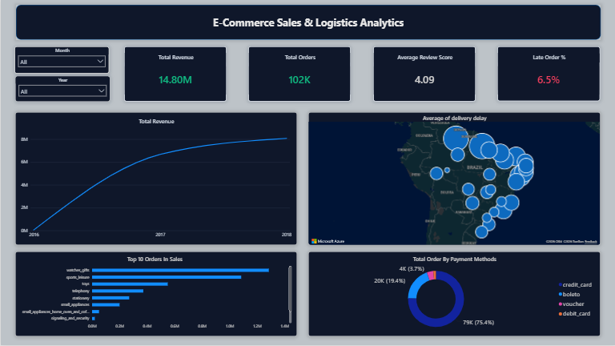
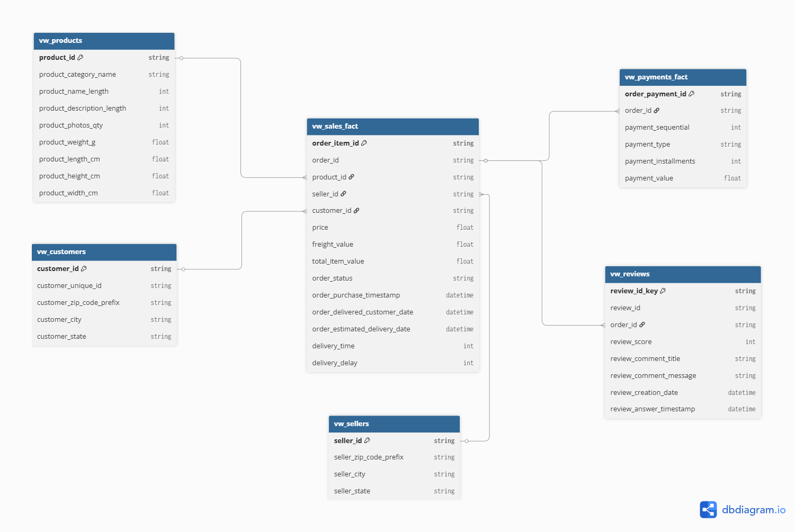

# 📊 Olist E-Commerce Sales & Logistics Analytics

> **End-to-End Data Engineering & Analytics Project using SQL Server (T-SQL) & Power BI**

## 📌 Project Overview

This project transforms raw operational e-commerce data from the Olist marketplace into a structured analytical solution using SQL Server and Power BI. The pipeline covers data staging and cleansing, Star Schema warehouse design, business logic enrichment, advanced SQL analytics, and interactive dashboard development for executive-level decision making.
The objective is to analyze sales performance, customer behavior, and logistics efficiency in order to support data-driven business decisions.

The solution includes:
- Data staging & cleaning
- Star schema data warehouse design
- SQL-based analytics layer
- Customer, sales, and logistics analysis
- Interactive Power BI dashboard

## 📷 Dashboard Preview


---

## 🛠️ Tech Stack & Skills Demonstrated

- **Database Engine:** SQL Server (T-SQL)
- **Data Architecture:** Staging Layer, Star Schema Modeling, Fact-to-Fact Relationships
- **Advanced SQL:** CTEs, Window Functions (`DENSE_RANK`, `LEAD`, `LAG`), Aggregations, Percentiles (`PERCENTILE_CONT`), Date Analytics (`DATEDIFF`)
- **Data Visualization:** Power BI
- **Power Query (M):** Custom Geocoding Lookup & Data Transformation
- **Data Modeling:** Fact & Dimension Design, Surrogate Keys, Data Integrity Controls

---

## 📐 Data Warehouse Architecture (Star Schema)

To optimize analytical query performance and minimize data redundancy, the raw staging tables were transformed into a Star Schema model.

## Schema Preview


### Fact Tables

- `vw_sales_fact` — Central sales fact containing orders, products, prices, freight costs, and logistics metrics.
- `vw_payments_fact` — Payment transactions maintained separately to preserve transaction-level granularity.
- `vw_reviews` — Customer review metrics and satisfaction data.

### Dimension Tables

- `vw_customers`
- `vw_products`
- `vw_sellers`
- `Date`

### Database Diagram (DBML)

```dbml
Table vw_customers {
  customer_id string [pk]
  customer_city string
  customer_state string
}

Table vw_products {
  product_id string [pk]
  product_category_name string
  product_weight_g float
}

Table vw_sellers {
  seller_id string [pk]
  seller_state string
}

Table vw_sales_fact {
  order_item_id string [pk]
  order_id string
  product_id string
  seller_id string
  customer_id string
  price float
  freight_value float
  total_item_value float
  order_status string
  order_purchase_timestamp datetime
  delivery_time int
  delivery_delay int
}

Ref: vw_customers.customer_id < vw_sales_fact.customer_id
Ref: vw_products.product_id < vw_sales_fact.product_id
Ref: vw_sellers.seller_id < vw_sales_fact.seller_id
```

---

## 🚀 Key Implementation Steps

### 1. Data Staging & Preprocessing

#### Handling Missing Data
Implemented `COALESCE()` logic to dynamically handle missing categorical values and maintain data completeness across staging tables.

#### Geospatial Optimization
Generated geographic centroids using coordinate averaging (`AVG`) grouped by ZIP code prefixes, significantly improving map visualization performance within Power BI.

#### Consistency Control
Applied surrogate keys using `IDENTITY(1,1)` alongside integrity constraints to ensure reliable synchronization and consistent dimensional modeling.

---

### 2. Business Logic Enrichment (SQL Views)

#### Logistics Performance Tracking
Developed delivery performance metrics using `CASE WHEN` expressions combined with `DATEDIFF()` calculations to measure delivery durations and identify delayed shipments.

#### Geocoding Enhancement
Built a Power Query M lookup dictionary using `Record.FieldOrDefault()` to automatically convert Brazilian state abbreviations into full state names, eliminating Bing Maps geocoding inconsistencies.

---

### 3. Business Intelligence Dashboard

#### Executive Dashboard Design
Designed a professional dark-themed dashboard focused on usability, KPI visibility, and interactive cross-filtering.

#### Business Metrics Tracked

- Revenue Performance Trends
- Top-Selling Product Categories
- Customer Satisfaction & Review Scores
- Delivery Performance & Logistics Delays
- Payment Method Distribution
- Seller Performance Analysis
- Regional Sales Distribution

---

## 📈 Advanced SQL Analytics

The project leverages advanced SQL techniques to generate business insights, including:

- Common Table Expressions (CTEs)
- Window Functions (`DENSE_RANK`, `LEAD`, `LAG`)
- Percentile Analysis (`PERCENTILE_CONT`)
- Revenue & Growth Analysis
- Customer Segmentation
- Logistics Performance Measurement
- Time-Series Trend Analysis

---

## 📊 Power BI Dashboard Features

- Interactive KPI Cards
- Revenue Trend Analysis
- Category Performance Breakdown
- Customer Review Insights
- Regional Sales Mapping
- Logistics & Delivery Monitoring
- Dynamic Filtering and Drill-Down Capabilities

---

## 🎯 Business Value Delivered

This solution enables stakeholders to:

- Monitor revenue performance in real time.
- Identify high-performing product categories.
- Detect logistics bottlenecks and delivery delays.
- Analyze customer satisfaction trends.
- Understand regional sales performance.
- Support data-driven operational and strategic decisions.

---

## 📈 Executive Results

For a complete business insights report, see:

[Executive Summary](docs/EXECUTIVE_SUMMARY.md)

---

## 📁 Repository Structure

```text
Olist-End-to-end-SQL-Analysis
│
├── README.md
│
├── Screenshots/
├── SQL Scripts/
├── Power BI/
│
└── docs/
    └── EXECUTIVE_SUMMARY.md
```

---


---

## 👤 Author

**Mahmoud Bahaa**

Data Analyst | BI Developer | SQL & Power BI Enthusiast
